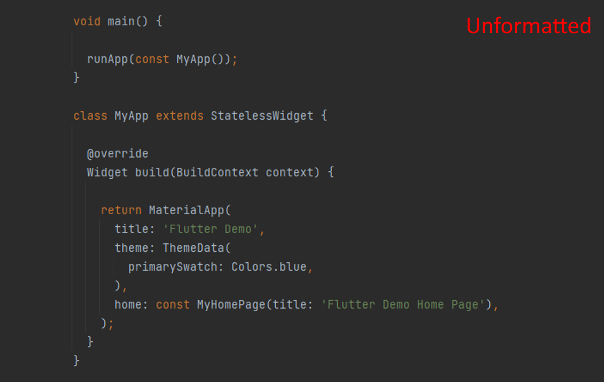
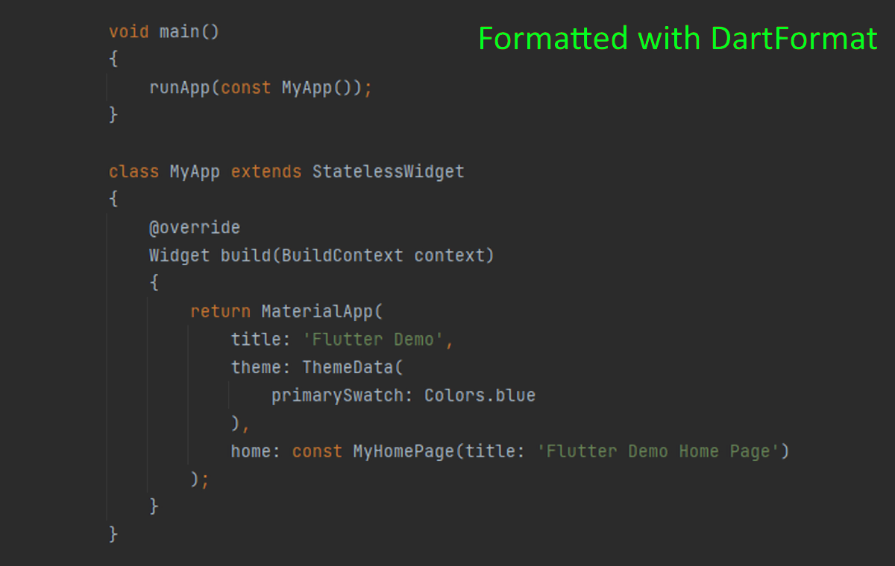

# dart_format

[](https://github.com/eggnstone/dart_format/actions)
[](https://pub.dev/packages/dart_format)
[](https://plugins.jetbrains.com/plugin/21003-dartformat)
[](https://marketplace.visualstudio.com/items?itemName=eggnstone.DartFormat)
[](https://github.com/eggnstone/dart_format/issues)
[](https://github.com/eggnstone/dart_format/stargazers)

A configurable formatter for Dart and Flutter. Like `dart format` /
`dartfmt`, but you decide the rules — brace placement, spacing,
trailing commas, indentation width, empty-line collapsing.

**Keeps your line breaks.** No forced wrapping at a line-length limit,
no inserted or removed line breaks unless you explicitly enable an
option that adds them.

| Before | After |
|--------|-------|
|  |  |

## Why dart_format?

The built-in `dart format` is opinionated by design: you take its
style or you don't. `dart_format` lets you decide.

**It never wraps lines.** No column limit, no automatic line breaks.
Long lines stay long; short lines stay short. The only line breaks
`dart_format` inserts are the ones you explicitly enable (e.g.
`addNewLineBeforeOpeningBrace`). If you didn't ask for a break, you
won't get one.

```dart
// dart format (built-in) — wraps at 80 columns
final user = User(
  name: 'Alice',
  email: 'alice@example.com',
  preferences: defaultPreferences,
);

// dart_format — keeps it on one line because you didn't ask for breaks
final user = User(name: 'Alice', email: 'alice@example.com', preferences: defaultPreferences);
```

```dart
// dart format (built-in)
void main() {
  if (debug) {
    print('hi');
  }
}

// dart_format with Allman braces + 4-space indent
void main()
{
    if (debug)
    {
        print('hi');
    }
}
```

It runs as a **CLI**, accepts source on **stdin**, and ships as a
long-running **HTTP service** used by the JetBrains plugin and VS Code
extension — so the same engine formats files from the terminal, your
editor, and CI.

## Configuration

Pass any subset as JSON via `--config` or `--config-file`. Missing keys
fall back to the defaults below.

| Option                         | Default | Controls                                      |
|--------------------------------|---------|-----------------------------------------------|
| `addNewLineBeforeOpeningBrace` | `true`  | `{` on its own line (Allman-style)            |
| `addNewLineAfterOpeningBrace`  | `true`  | Body always on a new line                     |
| `addNewLineBeforeClosingBrace` | `true`  | Closing `}` on its own line                   |
| `addNewLineAfterClosingBrace`  | `true`  | Newline after a block                         |
| `addNewLineAfterSemicolon`     | `true`  | One statement per line                        |
| `addNewLineAtEndOfText`        | `true`  | Trailing newline at end of file               |
| `fixSpaces`                    | `true`  | Normalise whitespace around tokens            |
| `indentationSpacesPerLevel`    | `4`     | Indent width (`-1` = leave untouched)         |
| `maxEmptyLines`                | `1`     | Collapse runs of blank lines (`-1` = leave)   |
| `removeTrailingCommas`         | `true`  | Strip trailing commas                         |

Example `dartformat.json`:

```json
{
    "IndentationSpacesPerLevel": 2,
    "AddNewLineBeforeOpeningBrace": false,
    "RemoveTrailingCommas": false
}
```

```sh
dart_format --config-file=dartformat.json lib
```

## Install

```sh
dart pub global activate dart_format
```

Or use one of the IDE integrations:

- **JetBrains** (IntelliJ IDEA, Android Studio, …):
  https://plugins.jetbrains.com/plugin/21003-dartformat
- **VS Code**:
  https://marketplace.visualstudio.com/items?itemName=eggnstone.DartFormat

Full install instructions: https://pub.dev/packages/dart_format/install

## Quick start

```sh
# Format a single file
dart_format lib/main.dart

# Format every .dart file under lib/ and test/
dart_format lib test

# Glob (handy on Windows where the shell does not expand wildcards)
dart_format "lib/**/*.dart"

# CI / pre-commit: exits non-zero if any file would change
dart_format --check lib

# Pipe stdin to stdout (auto-detected when no positional args are given)
cat lib/main.dart | dart_format
```

## CLI reference

```
Usage: dart_format [args] <file|dir|glob> [<file|dir|glob> ...]
    Positional inputs may be files, directories (recursed into *.dart),
    or glob patterns (e.g. "lib/**/*.dart").
    Pass `-` (or pipe stdin with no positional args) to format stdin to stdout.
    --check, -c                      No writes; exits non-zero if any file would change (for CI)
    --check-version                  Checks pub.dev for a newer dart_format release on start-up
    --config=<JSON>                  Inline configuration JSON (mutually exclusive with --config-file)
    --config-file=<PATH>             Path to a JSON config file (mutually exclusive with --config)
    --errors-as-json                 Writes errors as JSON to stderr
    --exclude=<GLOB>, -x <GLOB>      Excludes files matching the glob (repeatable)
    --help, -h                       Prints this help and exits
    --log-to-console[=true|false]    Logs to console
    --log-to-temp-file[=true|false]  Logs to a file in the system temp directory
    --port=<N>                       Port for web service mode (default: random free port, announced on stdout)
    --skip-version-check             Skips version check on start-up
    --version, -V                    Prints the version and exits
    --web                            Starts in web service mode
```

### Exclude examples

```sh
# Exclude by file ending (repeatable)
dart_format lib --exclude="**/*.g.dart" --exclude="**/*.freezed.dart"

# Exclude a folder
dart_format lib --exclude="**/legacy/**"

# Exclude a specific file
dart_format lib --exclude="lib/generated_code.dart"
```

### Default excludes

The following are always skipped during directory recursion and glob
expansion. Pass an explicit file path to format one of them on purpose.

- Folders: `.dart_tool/`, `build/`, and any hidden directory (`.git/`, `.idea/`, …).
- Codegen suffixes: `*.chopper.dart`, `*.config.dart`, `*.freezed.dart`,
  `*.g.dart`, `*.gen.dart`, `*.gr.dart`, `*.mocks.dart`, `*.pb*.dart`,
  `*.swagger.dart`.

## Security model

dart_format is designed for use on a single-user development machine. If
that matches your environment, the defaults are fine. The notes below
cover the cases where it doesn't.

- **Web mode** (`--web`, used by the IDE plugins) binds only to
  `127.0.0.1` and isn't authenticated. Anything running on the same
  machine — including other local user accounts on a multi-seat box —
  can talk to your formatter. The service can't read your files; it can
  only format text the caller sends it. Don't expose it beyond loopback.
- **Browser hardening** (2.2.0): the service rejects requests whose
  Host header isn't a loopback name, caps POST bodies at 4 MiB, and
  enforces a 60 s per-request wall-clock. That blocks the obvious
  DNS-rebinding and OOM-by-CSRF tricks a visited web page could play
  against `127.0.0.1`.
- **Temp logging**: in web mode, dart_format writes a session log to the
  system temp directory (filenames it touched, errors). Disable with
  `--log-to-temp-file=false`. CLI modes don't log unless
  `--log-to-temp-file` is passed.
- **Snapshot trust**: dart_format is installed via `dart pub global
  activate`, which stores a compiled snapshot in the pub cache.
  Anyone who can write to that directory can replace the binary. Same
  caveat as every other pub-installed CLI.
